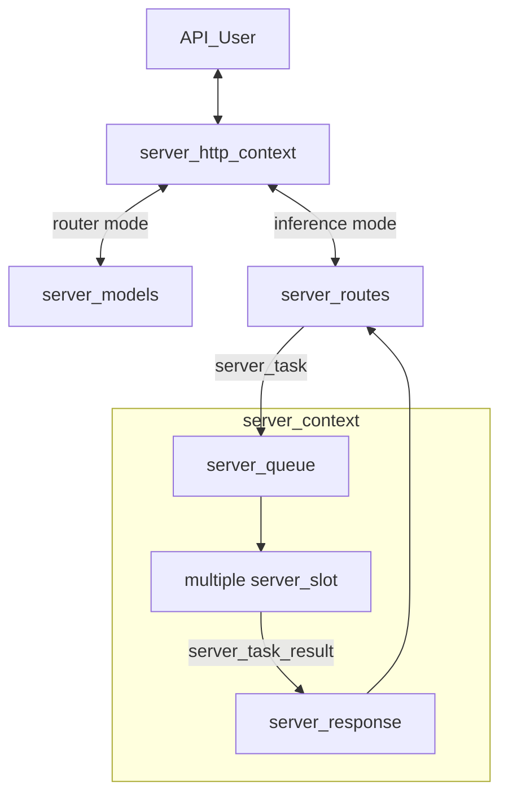

# llama-server development documentation

this doc provides an in-depth overview of the llama-server tool, helping maintainers and contributors.

if you are an user using llama-server as a product, please refer to the [main documentation](./README.md) instead

## Backend

### Overview

Server has 2 modes of operation:
- Inference mode: used for main inference with a model. This requires loading a GGUF model
- Router mode: used for managing multiple instances of the server, each instance is in inference mode. This allow user to use multiple models from the same API endpoint, since they are routed via a router server.

The project consists of these main components:

- `server_context`: hold the main inference context, including the main `llama_context` and slots
- `server_slot`: An abstraction layer of "sequence" in libllama, used for managing parallel sequences
- `server_routes`: the intermediate layer between `server_context` and HTTP layer. it contains logic to parse and format JSON for HTTP requests and responses
- `server_http_context`: hold the implementation of the HTTP server layer. currently, we use `cpp-httplib` as the implementation of the HTTP layer
- `server_queue`: A concurrent queue that allow HTTP threads to post new tasks to `server_context`
- `server_response`: A concurrent queue that allow `server_context` to send back response to HTTP threads
- `server_response_reader`: A high-level abstraction of `server_queue` and `server_response`, making the code easier to read and to maintain
- `server_task`: An unit of task, that can be pushed into `server_queue`
- `server_task_result`: An unit of response, that can be pushed into `server_response`
- `server_tokens`: An abstraction of token list, supporting both text and multimodal tokens; it is used by `server_task` and `server_slot`
- `server_prompt_checkpoint`: For recurrence and SWA models, we use this class to store a "snapshot" of the state of the model's memory. This allow re-using them when the following requests has the same prompt prefix, saving some computations.
- `server_models`: Component that allows managing multiple instances of llama-server, allow using multiple models. Please note that this is a standalone component, it independent from `server_context`



TODO: metion about how batching is handled by `server_slot`

### Thread management

`server_context` run on its own thread. Because is single-threaded, you should not add too many processing (especially post-token generation logic) to avoid negatively impact multi-sequence performance.

Each request have its own thread, managed by HTTP layer. These tasks are run inside HTTP thread:
- JSON request parsing
- Applying chat template
- Tokenizing
- Convert `server_task_result` into final JSON response
- Error handling (formatting error into JSON response)
- Partial response tracking (for example, tracking incremental tool calls or reasoning response)

Some rules practices to follow:
- Any JSON formatting and chat template handling must be done at HTTP level
- Prevent passing JSON back and forth between HTTP layer and `server_slot`. Instead, parse them at HTTP layer into native C++ data types

### Testing

llama-server has a testing system based on `pytest`

In a nutshell, this testing system automatically spawn an instance of `llama-server` and send test requests, then wait and check for the response.

For more info, please refer to the (test documentation)[./tests/README.md]

### Related PRs

- Initial server implementation: https://github.com/ggml-org/llama.cpp/pull/1443
- Support parallel decoding: https://github.com/ggml-org/llama.cpp/pull/3228
- Refactor, adding `server_queue` and `server_response`: https://github.com/ggml-org/llama.cpp/pull/5065
- Reranking support: https://github.com/ggml-org/llama.cpp/pull/9510
- Multimodel support (`libmtmd`): https://github.com/ggml-org/llama.cpp/pull/12898
- Unified KV support: https://github.com/ggml-org/llama.cpp/pull/16736
- Refactor, separate HTTP logic into its own cpp/h interface: https://github.com/ggml-org/llama.cpp/pull/17216
- Refactor, break the code base into smaller cpp/h files: https://github.com/ggml-org/llama.cpp/pull/17362
- Adding "router mode" to server: https://github.com/ggml-org/llama.cpp/pull/17470


## Web UI


The project includes a web-based user interface for interacting with `llama-server`. It supports both single-model (`MODEL` mode) and multi-model (`ROUTER` mode) operation.

The SvelteKit-based Web UI is introduced in this PR: https://github.com/ggml-org/llama.cpp/pull/14839

### Features

-   **Chat interface** with streaming responses
-   **Multi-model support** (ROUTER mode) - switch between models, auto-load on selection
-   **Modality validation** - ensures selected model supports conversation's attachments (images, audio)
-   **Conversation management** - branching, regeneration, editing with history preservation
-   **Attachment support** - images, audio, PDFs (with vision/text fallback)
-   **Configurable parameters** - temperature, top_p, etc. synced with server defaults
-   **Dark/light theme**

### Tech Stack

-   **SvelteKit** - frontend framework with Svelte 5 runes for reactive state
-   **TailwindCSS** + **shadcn-svelte** - styling and UI components
-   **Vite** - build tooling
-   **IndexedDB** (Dexie) - local storage for conversations
-   **LocalStorage** - user settings persistence

### Architecture

The WebUI follows a layered architecture:

```
Routes → Components → Hooks → Stores → Services → Storage/API
```

-   **Stores** - reactive state management (`chatStore`, `conversationsStore`, `modelsStore`, `serverStore`, `settingsStore`)
-   **Services** - stateless API/database communication (`ChatService`, `ModelsService`, `PropsService`, `DatabaseService`)
-   **Hooks** - reusable logic (`useModelChangeValidation`, `useProcessingState`)

For detailed architecture diagrams, see [`tools/server/webui/docs/`](webui/docs/):

-   `high-level-architecture.mmd` - full architecture with all modules
-   `high-level-architecture-simplified.mmd` - simplified overview
-   `data-flow-simplified-model-mode.mmd` - data flow for single-model mode
-   `data-flow-simplified-router-mode.mmd` - data flow for multi-model mode
-   `flows/*.mmd` - detailed per-domain flows (chat, conversations, models, etc.)

### Development

```sh
# make sure you have Node.js installed
cd tools/server/webui
npm i

# run dev server (with hot reload)
npm run dev

# run tests
npm run test

# build production bundle
npm run build
```

After `public/index.html.gz` has been generated, rebuild `llama-server` as described in the [build](#build) section to include the updated UI.

**Note:** The Vite dev server automatically proxies API requests to `http://localhost:8080`. Make sure `llama-server` is running on that port during development.
